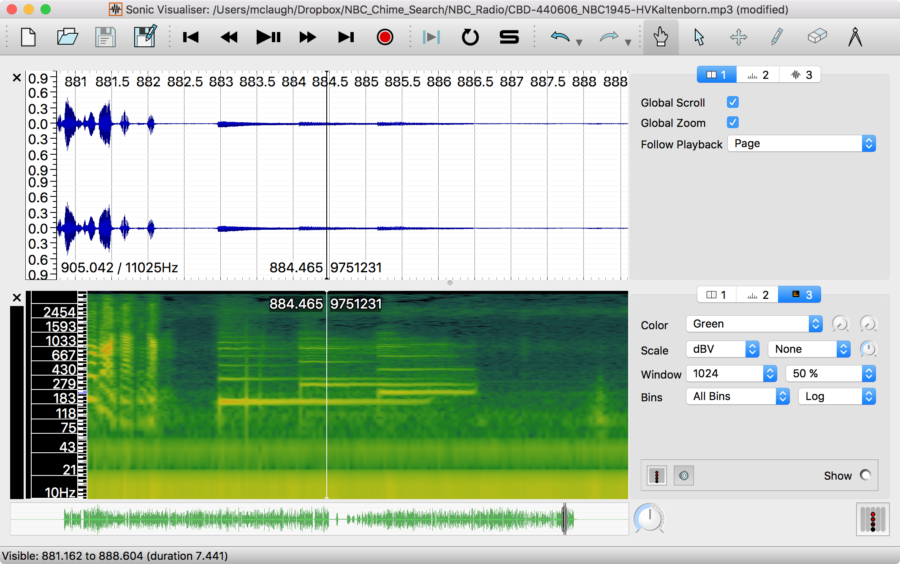
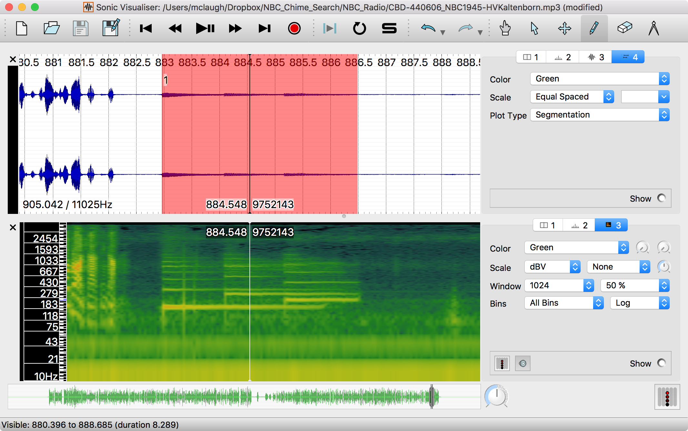
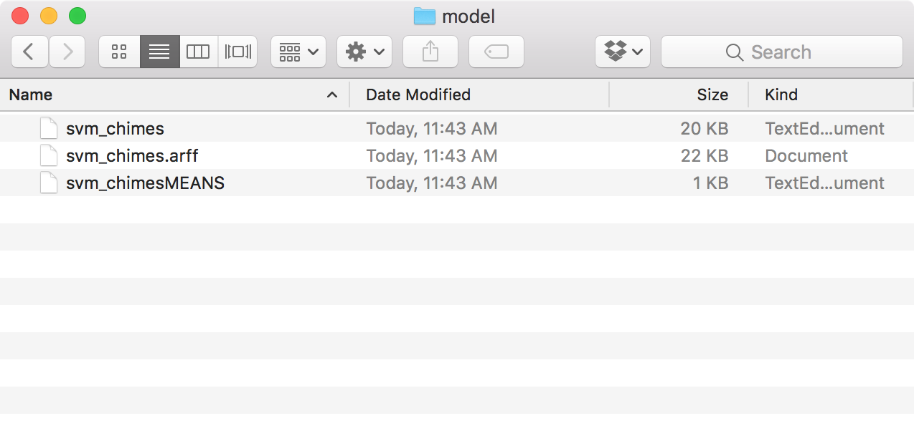

# Workshop: Audio Machine Learning Introduction

- Download five or ten historical NBC radio recordings from Archive.org and place them in a folder called "NBC_Radio" on your desktop.
  - https://archive.org/details/NBCCompleteBroadcastDDay/
  - easy download: https://www.dropbox.com/sh/zd0pxk2gcq079xh/AAC-JYAO3JP5MeTMa1F0K6F3a?dl=0


- Open one of the recordings in Sonic Visualiser. In the toolbar, select "Pane > Add Spectrogram > [filename]: All Channels Mixed." A spectral representation of your audio will appear at the bottom of the window.


- Use the up and down arrows (or scroll using your mouse) to zoom. To the right of the spectrogram, in the second dropdown menu next to "Bins," change the option "Linear" to "Log."


- Use your left and right arrow keys (or scroll sideways using mouse) to examine the recording. Here is a typical example of speech audio.


- Scroll to the end of the file and see if you can identify the NBC chime sequence by eye. It should look something like this.




- Next we'll apply a tag that identifies this segment of audio. In the toolbar, choose "Layer > Add New Regions Layer." 
- The Draw tool in the upper right should be highlighted automatically. To make it easier to see our work, click the dropdown menu next to "Plot Type" and choose "Segmentation."
- Click and drag in the waveform at the top of the window to select just the chime segment.




- In the toolbar, select "File > Export Annotation Layer" and enter a name for your annotation file. For convenience, I recommend using the name of the audio file, using the extension ".csv" instead of ".mp3."
- Open the CSV file in a text editor. It should look something like this: one line with three values separated by commas. The first number is the starting time of our tagged segment, in seconds. The last number is the duration of our tag. The second value, "1," is a numeric class identifier; more on this later.


- Repeat this process, collecting tags for five or ten chime sequences. Note: you can close the Sonic Visualiser window before opening a new file

### Extracting Chime Audio

- Next we'll extract these segments as new audio files. If you haven't already, download Audio Tagging Toolkit.

  - https://github.com/hipstas/audio-tagging-toolkit

- Open a new terminal window and `cd` to the toolkit's directory.

```
cd /path/to/audio-tagging-toolkit/
```


- To run a script, we will execute it using Python along with a series of options. Here is the basic format.

```
python ExcerptClass.py -i /path/to/audio.mp3 -t /path/to/tags.csv -e 1 -o /path/to/output/directory
```

- The "-i" option is the pathname for our audio file. The "-t" option points to a CSV tag file from Sonic Visualiser. The "-e" option indicates we want to extract audio for class 1, which we saw in the CSV file above. 

- To get a file's pathname, drag its icon from a Finder window into a terminal window. 

- Create a folder called "NBC_Chimes" on your desktop, which we will use as our output folder. Construct a command for each of the files you tagged. Here is an example for a file called "CBD-440606_NBC1945-HVKaltenborn.mp3":

```
python ExcerptClass.py -i ~/Desktop/NBC_Radio/CBD-440606_NBC1945-HVKaltenborn.mp3 -t ~/Desktop/NBC_Radio/CBD-440606_NBC1945-HVKaltenborn.csv -e 1 -o ~/Desktop/NBC_Chimes/
```


### Extracting Non-Chime Audio

- We also need examples of non-chime audio in order to train our classifier, so let's choose some clips at random. The `RandomTags.py` script in Audio Tagging Toolkit will handle the details. 

```
python RandomTags.py -n 3 -s 3 -e -i /path/to/example.mp3 -o /path/to/output_dir/
```
- The example above will extract three clips from example.mp3, each three seconds long. It will then export them as WAV files to a specified output directory.

- Create a folder on your desktop called "NBC_Not_Chimes." Try entering a command like the one above to see if it works.

- If you don't want to enter a new `RandomTags.py` command for each file, you can loop through your audio files using a short bash script:

```
for filename in ~/Desktop/NBC_Radio/*.mp3; do
python RandomTags.py -n 3 -s 3 -e -i $filename -o ~/Desktop/NBC_Not_Chimes/ ;
done
```

- Once you've generated a set of random audio segments, you'll need to make sure they don't include any chime audio by mistake. Open VLC Media Player and drag your random files into the playlist window. Now listen to the set; if a clip contains chimes, locate it in the Finder and delete it.

### Training Classifier Model

- Enter the following command to launch the Python shell:

```
python
```

- Now enter the following to import packages, set our working directory to the desktop, and create a folder called "data."

```python
from pyAudioAnalysis import audioTrainTest as aT
import os
os.chdir(os.path.expand('~/Desktop/')
os.makedirs('data')
```

- If the desktop contains directories called "NBC_Chimes" and "NBC_Not_Chimes," the following command will use any WAV audio files they contain to train a support vector machine (SVM) classifier.

```python
aT.featureAndTrain(['NBC_Not_Chimes','NBC_Chimes'], 1.0, 1.0, aT.shortTermWindow, aT.shortTermStep, "svm", "data/svm_chimes", False)
```

- This will output a model file called "svm_chimes" in the "data" directory, along with several supporting files.



